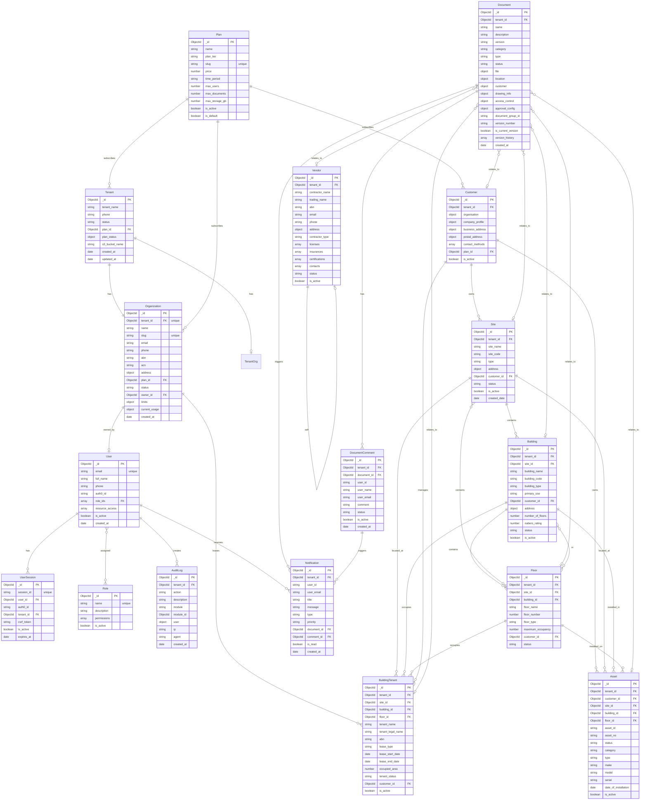

# ER Diagram - Mermaid Format

This file contains the ER diagram in Mermaid syntax for visual rendering in Markdown viewers that support Mermaid.

## Complete Entity Relationship Diagram

## Relationship Types

### One-to-One (||--||)
- Tenant ↔ Organization
- Tenant ↔ TenantOrg

### One-to-Many (||--o{)
- Plan → Tenant, Organization, Customer
- User → UserSession, AuditLog
- Site → Building, Floor
- Building → Floor, BuildingTenant, Asset
- Floor → BuildingTenant, Asset
- Organization → BuildingTenant
- Customer → Site, Building, Floor, Asset, BuildingTenant
- Document → DocumentComment
- User → Notification
- Document → Notification

### Many-to-Many (}o--o{)
- User ↔ Role
- Document ↔ Site, Building, Floor, Asset, BuildingTenant, Vendor (via location object)

### Optional Relationships (||--o|)
- Organization → User (owner)
- BuildingTenant → Floor (optional)

## Key Features

1. **Multi-Tenancy**: Most entities include `tenant_id` for isolation
2. **Soft Deletes**: `is_active` flags on most entities
3. **Audit Trail**: All operations logged to AuditLog
4. **Version Control**: Documents support versioning with `document_group_id`
5. **Flexible Associations**: Documents use embedded location objects for polymorphic relationships
6. **Fine-grained Permissions**: Users have `resource_access` array for granular control

