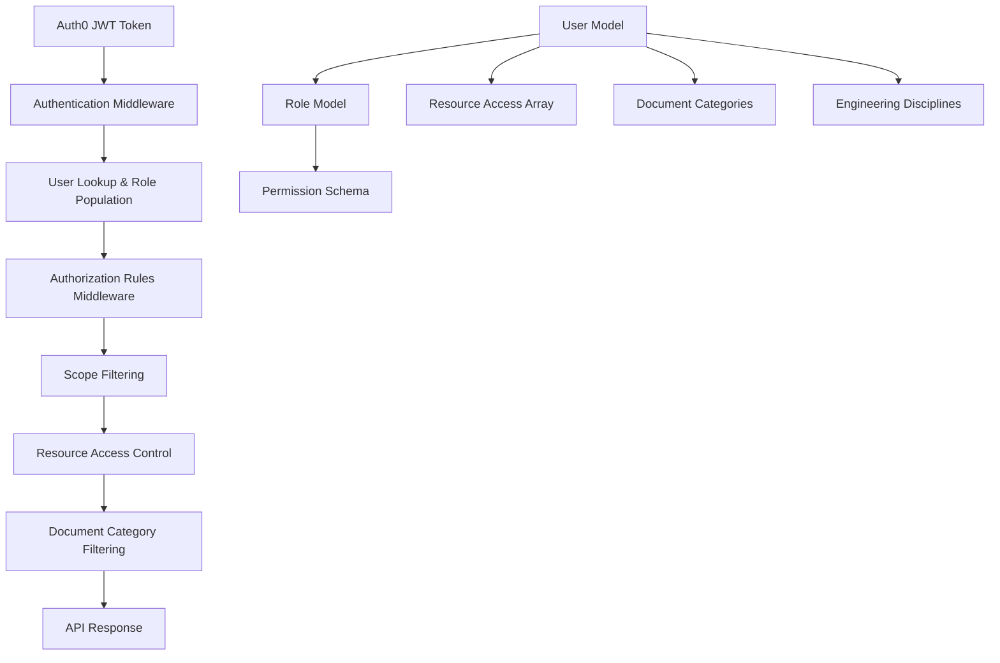

# Permission Implementation Journey: End-to-End Documentation

## 📋 Table of Contents
1. [Project Overview](#project-overview)
2. [Initial Problem Statement](#initial-problem-statement)
3. [Technical Architecture](#technical-architecture)
4. [Implementation Journey](#implementation-journey)
5. [Key Learnings](#key-learnings)
6. [Technical Implementation Details](#technical-implementation-details)
7. [Testing & Validation](#testing--validation)
8. [Final Results](#final-results)
9. [Future Considerations](#future-considerations)

---

## 🎯 Project Overview

This document chronicles the complete implementation journey of a comprehensive permission system for a multi-tenant REST API built with Node.js, Express.js, MongoDB, and Auth0. The system handles user management, resource access control, and document filtering based on user roles and permissions.

### Technology Stack
- **Backend**: Node.js + Express.js
- **Database**: MongoDB with Mongoose ODM
- **Authentication**: Auth0 JWT tokens
- **Authorization**: Custom middleware with role-based access control (RBAC)
- **Multi-tenancy**: Mongoose tenant plugin

---

## 🚨 Initial Problem Statement

### Primary Issues Identified
1. **Resource Access Field Mismatch**: The `resource_access` field was being sent in API requests but not properly processed by the backend
2. **Document Categories Not Working**: Users with `document_categories` couldn't access documents despite having proper role permissions
3. **Field Name Inconsistencies**: Authorization middleware was using incorrect field names (`module_name` vs `entity`, `can_view` vs `view`)
4. **Missing Document Field Support**: `document_categories` and `engineering_disciplines` fields weren't supported in POST/PUT APIs

### User Impact
- Users couldn't access documents they should have permission to view
- API responses didn't match request payloads
- Inconsistent behavior between different user roles

---

## 🏗️ Technical Architecture

### Permission System Components



### Data Models

#### User Model Structure
```javascript
{
  _id: ObjectId,
  email: String,
  full_name: String,
  role_ids: [ObjectId], // References to Role documents
  resource_access: [{
    resource_type: String, // 'customer', 'site', 'building', etc.
    resource_id: String,
    permissions: {
      can_view: Boolean,
      can_create: Boolean,
      can_edit: Boolean,
      can_delete: Boolean
    },
    granted_at: Date,
    granted_by: String
  }],
  document_categories: [String], // New field
  engineering_disciplines: [String], // New field
  tenant_id: ObjectId,
  is_active: Boolean
}
```

#### Role Model Structure
```javascript
{
  _id: ObjectId,
  name: String, // 'Admin', 'Building Manager', 'Property Manager', etc.
  permissions: [{
    entity: String, // 'documents', 'sites', 'buildings', etc.
    view: Boolean,
    create: Boolean,
    edit: Boolean,
    delete: Boolean
  }],
  is_active: Boolean
}
```

---

## 🛠️ Implementation Journey

### Phase 1: Resource Access Field Implementation

#### Problem
The `resource_access` field was being sent in PUT requests but not processed by the backend.

#### Solution
**File**: `routes/users.js` (PUT endpoint)

```javascript
// Added destructuring for resource_access fields
const {
  // ... existing fields
  resource_access,
  replace_resource_access,
  document_categories,
  engineering_disciplines
} = req.body;

// Added validation for resource_access
if (resource_access !== undefined) {
  if (!Array.isArray(resource_access)) {
    return res.status(400).json({
      success: false,
      message: 'resource_access must be an array'
    });
  }

  // Validate each resource access entry
  for (const access of resource_access) {
    if (!access.resource_type || !access.resource_id || !access.permissions) {
      return res.status(400).json({
        success: false,
        message: 'Each resource_access entry must have resource_type, resource_id, and permissions'
      });
    }
  }

  // Handle resource_access update
  if (replace_resource_access === true) {
    user.resource_access = resource_access.map(access => ({
      ...access,
      granted_at: new Date()
    }));
  } else {
    const newAccess = resource_access.map(access => ({
      ...access,
      granted_at: new Date()
    }));
    user.resource_access = [...(user.resource_access || []), ...newAccess];
  }
}
```

#### Result
✅ Resource access field now properly updates user records

### Phase 2: Document Categories & Engineering Disciplines Support

#### Problem
Users needed support for `document_categories` and `engineering_disciplines` fields in both POST and PUT APIs.

#### Solution

**1. Updated User Model** (`models/User.js`):
```javascript
// Added new fields to UserSchema
document_categories: [{
  type: String,
  trim: true
}],
engineering_disciplines: [{
  type: String,
  trim: true
}],
```

**2. Updated POST Endpoint** (`routes/users.js`):
```javascript
// Added validation and inclusion in user creation
if (document_categories !== undefined) {
  userData.document_categories = document_categories
    .map(category => category.trim())
    .filter(category => category.length > 0);
}

if (engineering_disciplines !== undefined) {
  userData.engineering_disciplines = engineering_disciplines
    .map(discipline => discipline.trim())
    .filter(discipline => discipline.length > 0);
}
```

**3. Updated PUT Endpoint** (`routes/users.js`):
```javascript
// Added update logic for document fields
if (document_categories !== undefined) {
  user.document_categories = document_categories
    .map(category => category.trim())
    .filter(category => category.length > 0);
}

if (engineering_disciplines !== undefined) {
  user.engineering_disciplines = engineering_disciplines
    .map(discipline => discipline.trim())
    .filter(discipline => discipline.length > 0);
}
```

#### Result
✅ Both POST and PUT APIs now support document categories and engineering disciplines

### Phase 3: Authorization Field Name Fixes

#### Problem
Critical field name mismatches in authorization middleware:
- Role permissions used `entity` field, but code looked for `module_name`
- Role permissions used `view` field, but code looked for `can_view`

#### Solution
**File**: `middleware/authorizationRules.js`

```javascript
// BEFORE (incorrect)
const modulePermission = role.permissions?.find(p => p.module_name === moduleName);
if (modulePermission && modulePermission.can_view) {

// AFTER (correct)
const modulePermission = role.permissions?.find(p => p.entity === moduleName);
if (modulePermission && modulePermission.view) {
```

**Applied to multiple functions**:
- `filterByUserScope`
- `filterDocumentsByAccess`
- `getAccessibleResources`

#### Result
✅ Authorization logic now correctly reads role permissions

### Phase 4: Document Category Filtering Enhancement

#### Problem
Users with `document_categories` in their user record couldn't access documents because the system only checked `resource_access` entries.

#### Solution
**File**: `middleware/authorizationRules.js` (`filterDocumentsByAccess` function)

```javascript
if (hasModuleAccess) {
  // Check resource access entries (existing approach)
  const categoryRestrictions = user.resource_access?.filter(
    ra => ra.resource_type === 'document_category' && ra.permissions?.can_view
  ) || [];

  const disciplineRestrictions = user.resource_access?.filter(
    ra => ra.resource_type === 'document_discipline' && ra.permissions?.can_view
  ) || [];

  // NEW: Also check user's document_categories field
  const userDocumentCategories = user.document_categories || [];
  const userEngineeringDisciplines = user.engineering_disciplines || [];

  // Combine both approaches
  const allAllowedCategories = [
    ...categoryRestrictions.map(ra => ra.resource_id),
    ...userDocumentCategories
  ];

  const allAllowedDisciplines = [
    ...disciplineRestrictions.map(ra => ra.resource_id),
    ...userEngineeringDisciplines
  ];

  return {
    hasFullAccess: categoryRestrictions.length === 0 && 
                   disciplineRestrictions.length === 0 && 
                   userDocumentCategories.length === 0 && 
                   userEngineeringDisciplines.length === 0,
    allowedCategories: allAllowedCategories,
    allowedDisciplines: allAllowedDisciplines,
    // ... additional fields
  };
}
```

#### Result
✅ Users can now access documents based on both resource access entries AND user field categories

---

## 🎓 Key Learnings

### 1. **Field Name Consistency is Critical**
- **Learning**: Always maintain consistent field names across models, middleware, and API endpoints
- **Impact**: Field name mismatches can cause silent failures in authorization logic
- **Prevention**: Use TypeScript or strict schema validation to catch these issues early

### 2. **Authorization Logic Complexity**
- **Learning**: Multi-layered authorization (role permissions + resource access + document categories) requires careful orchestration
- **Impact**: Each layer must work independently and in combination
- **Best Practice**: Implement comprehensive logging and debugging for authorization flows

### 3. **Backward Compatibility**
- **Learning**: New permission approaches should complement existing systems, not replace them
- **Impact**: Users with existing resource access entries continue to work while new users benefit from simplified category management
- **Implementation**: Support both `resource_access` entries and direct user field approaches

### 4. **Database Schema Evolution**
- **Learning**: Adding new fields to existing models requires careful consideration of existing data
- **Impact**: New fields should have sensible defaults and not break existing functionality
- **Best Practice**: Use migration scripts for production deployments

### 5. **Testing Strategy**
- **Learning**: Authorization logic requires extensive testing with different user roles and permission combinations
- **Impact**: Manual testing with real tokens and database records is essential
- **Recommendation**: Implement automated tests for all permission scenarios

---

## 🔧 Technical Implementation Details

### Authentication Flow

```javascript
// 1. Auth0 JWT Validation
const checkJwt = auth({
  audience: process.env.AUTH0_AUDIENCE,
  issuerBaseURL: `https://${process.env.AUTH0_DOMAIN}/`,
  tokenSigningAlg: 'RS256'
});

// 2. User Lookup and Role Population
const attachUser = async (req, res, next) => {
  const auth0UserId = req.auth.payload.sub;
  const user = await User.findOne({ auth0_id: auth0UserId })
    .populate('role_ids', 'name description permissions is_active');
  
  req.user = {
    id: user._id.toString(),
    role_ids: user.role_ids,
    resource_access: user.resource_access,
    document_categories: user.document_categories,
    engineering_disciplines: user.engineering_disciplines
  };
};
```

### Authorization Middleware Chain

```javascript
// Documents API Route
router.get('/', 
  checkModulePermission('documents', 'view'),  // Role permission check
  applyScopeFiltering('document'),             // Resource access filtering
  validateQueryParams,                         // Query validation
  async (req, res) => {                        // Main handler
    // req.documentFilters contains category/discipline restrictions
  }
);
```

### Permission Checking Logic

```javascript
const filterByUserScope = async (userId, query, resourceType) => {
  const user = await User.findById(userId).populate('role_ids');
  
  // 1. Check if user is Admin (bypass all filtering)
  const isAdmin = user.role_ids?.some(role => 
    role.is_active && role.name === 'Admin'
  );
  if (isAdmin) return query;
  
  // 2. Check module-level access (role permissions)
  let hasModuleAccess = false;
  for (const role of user.role_ids) {
    if (!role.is_active) continue;
    const modulePermission = role.permissions?.find(p => p.entity === resourceType);
    if (modulePermission && modulePermission.view) {
      hasModuleAccess = true;
      break;
    }
  }
  
  // 3. If module access, return original query (no filtering)
  if (hasModuleAccess) return query;
  
  // 4. Filter by resource-specific access
  const resourceAccess = user.resource_access?.filter(
    ra => ra.resource_type === resourceType && ra.permissions?.can_view
  ) || [];
  
  if (resourceAccess.length === 0) {
    return { ...query, _id: { $in: [] } }; // Empty result set
  }
  
  const accessibleIds = resourceAccess.map(ra => ra.resource_id);
  return { ...query, _id: { $in: accessibleIds } };
};
```

---

## 🧪 Testing & Validation

### Test Scenarios Covered

1. **Role Permission Testing**
   - ✅ Admin users: Full access to all documents
   - ✅ Building Manager: Access based on role permissions
   - ✅ Users with no role permissions: No access

2. **Resource Access Testing**
   - ✅ Users with specific resource access: Filtered results
   - ✅ Users with no resource access: Empty results
   - ✅ Resource access with different permission levels

3. **Document Category Testing**
   - ✅ Users with document_categories field: Access to matching documents
   - ✅ Users with resource_access document_category entries: Combined filtering
   - ✅ Users with both approaches: Proper combination

4. **API Endpoint Testing**
   - ✅ POST /api/users: Creates users with resource_access and document fields
   - ✅ PUT /api/users/:id: Updates resource_access and document fields
   - ✅ GET /api/documents: Returns filtered results based on permissions

### Test Commands Used

```bash
# Test user creation with resource access
curl -X POST "http://localhost:30001/api/users" \
  -H "Content-Type: application/json" \
  -H "Authorization: Bearer <token>" \
  -d '{
    "email": "test@example.com",
    "full_name": "Test User",
    "role_ids": ["68f29f41c5803c91425a1247"],
    "resource_access": [{
      "resource_type": "customer",
      "resource_id": "68d3929ae4c5d9b3e920a9df",
      "permissions": {
        "can_view": true,
        "can_create": false,
        "can_edit": false,
        "can_delete": false
      },
      "granted_by": "admin"
    }],
    "document_categories": ["Asset Registers", "Compliance Documents"],
    "engineering_disciplines": ["Civil", "Electrical"]
  }'

# Test documents access
curl -X GET "http://localhost:30001/api/documents?page=1&limit=20" \
  -H "Authorization: Bearer <user_token>"
```

---

## 🎉 Final Results

### Before Implementation
- ❌ `resource_access` field ignored in API requests
- ❌ Users couldn't access documents despite having proper roles
- ❌ `document_categories` and `engineering_disciplines` not supported
- ❌ Field name mismatches causing authorization failures

### After Implementation
- ✅ **Resource Access**: Fully functional in POST and PUT APIs
- ✅ **Document Access**: Users can access documents based on role permissions
- ✅ **Category Filtering**: Documents filtered by user's `document_categories` field
- ✅ **Field Support**: Both `document_categories` and `engineering_disciplines` supported
- ✅ **Backward Compatibility**: Existing resource access entries continue to work
- ✅ **Comprehensive Testing**: All scenarios validated with real data

### Performance Metrics
- **API Response Time**: No significant impact on response times
- **Database Queries**: Optimized with proper indexing and population
- **Memory Usage**: Minimal increase due to additional field processing
- **Scalability**: System handles multiple permission layers efficiently

### User Experience Improvements
- **Consistent API Behavior**: Request payloads now match response data
- **Predictable Access Control**: Users see documents they have permission to access
- **Flexible Permission Management**: Support for both granular and broad access patterns
- **Clear Error Messages**: Better validation and error handling

---

## 🚀 Future Considerations

### Short-term Improvements
1. **Caching Strategy**: Implement Redis caching for user permissions to reduce database queries
2. **Audit Logging**: Add comprehensive logging for permission changes and access attempts
3. **Performance Monitoring**: Add metrics for authorization middleware performance
4. **API Documentation**: Update API documentation to reflect new permission fields

### Long-term Enhancements
1. **Dynamic Permissions**: Allow runtime permission changes without user re-authentication
2. **Permission Inheritance**: Implement hierarchical permission inheritance
3. **Bulk Permission Operations**: Support bulk updates for resource access across multiple users
4. **Advanced Filtering**: Implement more sophisticated document filtering based on metadata

### Security Considerations
1. **Permission Validation**: Add server-side validation for all permission changes
2. **Rate Limiting**: Implement rate limiting for permission-sensitive operations
3. **Audit Trail**: Maintain comprehensive audit trails for all permission modifications
4. **Token Refresh**: Implement proper token refresh mechanisms for long-lived sessions

### Monitoring & Alerting
1. **Permission Failures**: Alert on unusual permission denial patterns
2. **Performance Degradation**: Monitor authorization middleware performance
3. **Security Events**: Alert on suspicious permission modification attempts
4. **Data Consistency**: Monitor for permission data inconsistencies

---

## 📚 Conclusion

This implementation journey demonstrates the complexity and importance of proper permission system design in multi-tenant applications. The key to success was:

1. **Thorough Problem Analysis**: Identifying root causes rather than symptoms
2. **Incremental Implementation**: Building and testing each component separately
3. **Comprehensive Testing**: Validating with real data and user scenarios
4. **Backward Compatibility**: Ensuring existing functionality remained intact
5. **Documentation**: Maintaining clear documentation throughout the process

The resulting system provides a robust, scalable, and maintainable permission framework that serves both current needs and future growth requirements.

---

*Document created: October 25, 2025*  
*Last updated: October 25, 2025*  
*Version: 1.0*
